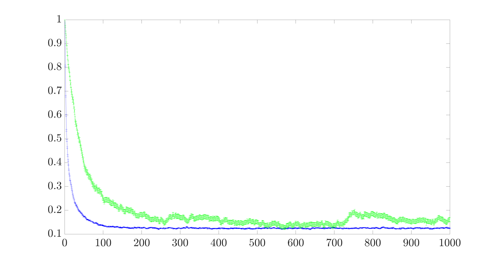
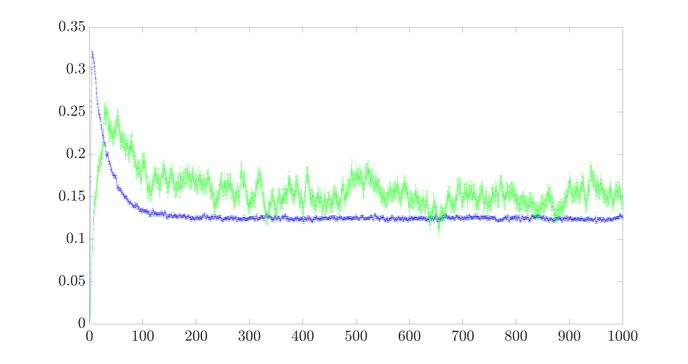
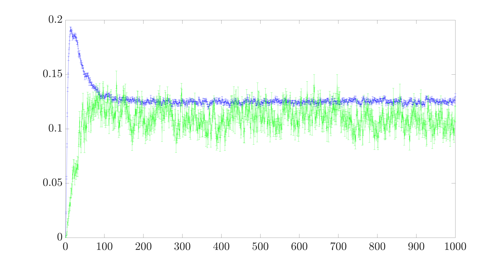
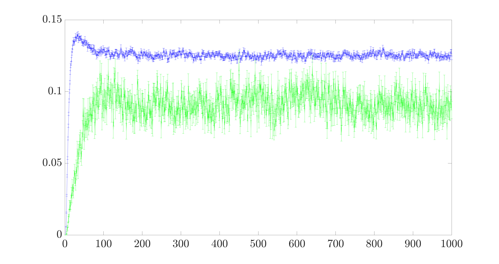
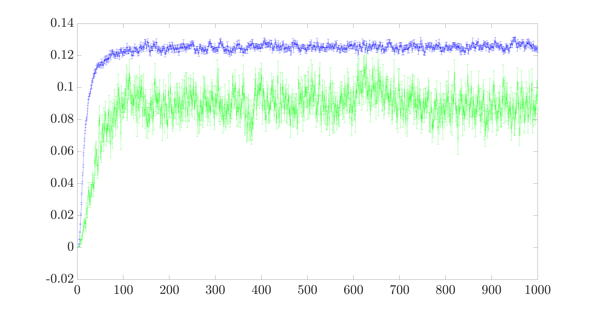
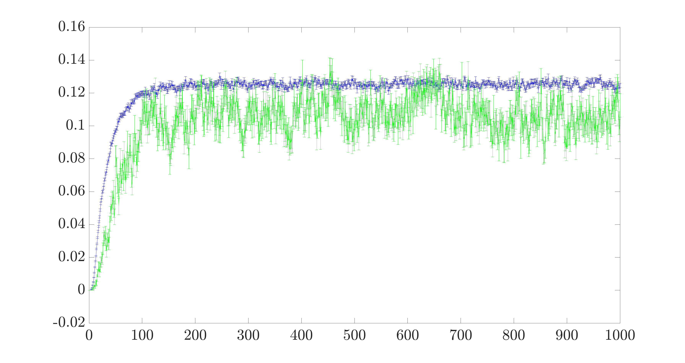
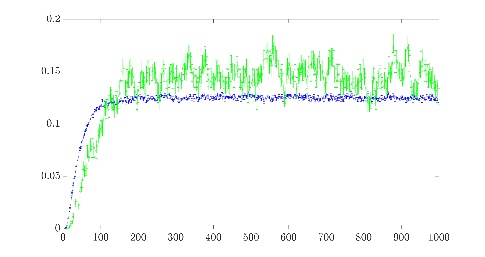
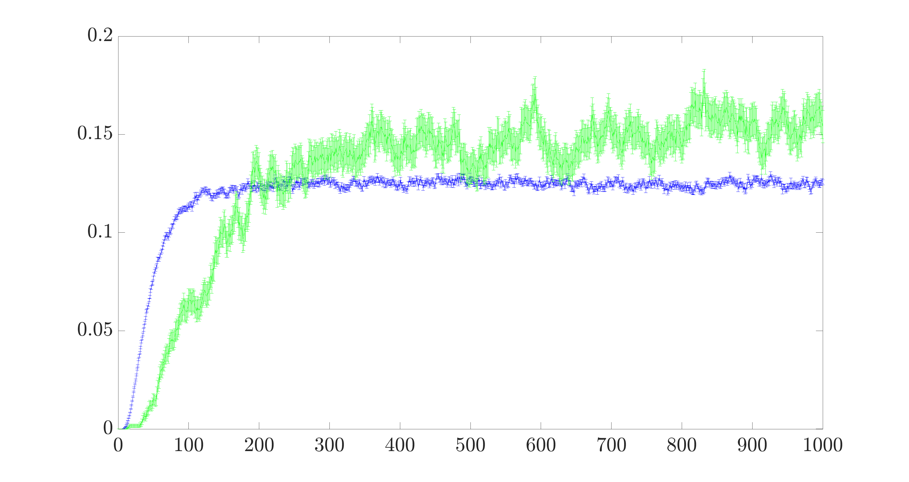

=========================================================================
Plots that Display the Probability of the Particle Occupying Each y-Index
=========================================================================

These plots show the attempted production of negative gravitational mass using the model where both entanglement and wave function collapse operations are utilized. The system size is :math:`$L_x=2$` and :math:`$L_y=8$`. This method attempts to produce a negative gravitational mass by have the entanglement and wave function collapse operations be least likely to occur for y-indices 3 and 4 with the likelihood growing from y-indices 4 to 7 and from 3 to 0. The probability vector that defines how this process is implemented is given by :math:`$p=[0.45\ (0.45+0.45/10)\ (0.45+0.45/10+0.45/100)\ 0.5\ (1 - 0.45-0.45/10-0.45/100)\ (1 - 0.45-0.45/10)\ (1 - 0.45)\ 1]$`. The corresponding plot in the paper has the y-indices plotted along the x-axis and the probability for the particle to occupy each of the y-indices after 1000 driving cycles is plotted along the y-axis. The following plots detail information about each y-index specifically with the corresponding y-index of interest being displayed above each plot. The x-axis of these plots display the number of driving cycles that have elapsed from 1 to 1000 and the y-axis displays the probability of the particle to occupy the y-index of interest.

Y-Index 0
---------

Y-Index 1
---------

Y-Index 2
---------

Y-Index 3
---------

Y-Index 4
---------

Y-Index 5
---------

Y-Index 6
---------

Y-Index 7
---------

